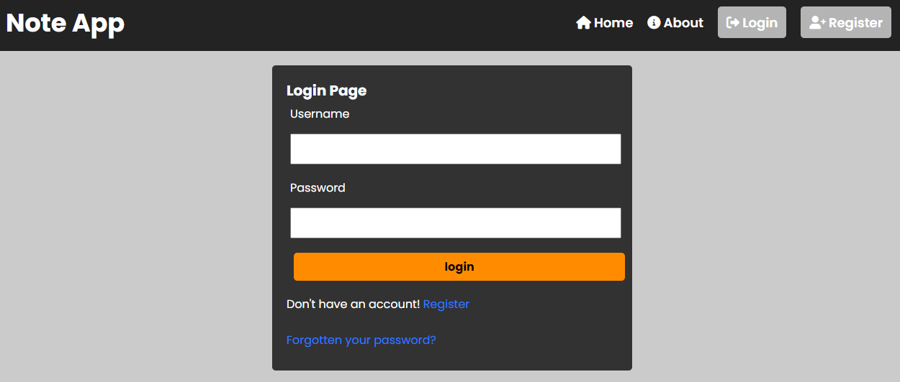
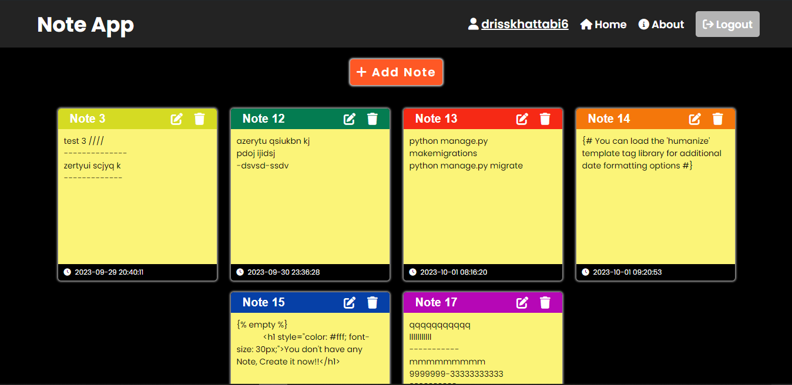

# Django Note App :


This repository contains a **Notes App** Project developed using the Django Framework.

Every User can create, edit, and delete Notes after creating an account in the app.

this is a example image of the Login page of the Note App : 



this is a example image of the main page of the Note App : 




## Run Project : 

Download the project first using this cmd :

```
git clone https://github.com/drisskhattabi6/Django-Note-App.git
```

Once the project is downloaded, navigate into the project directory:

```
cd Django-Note-App
```

Before running the project, make sure you have Python and Django installed on your system. You can install Django using pip:

```
pip install -r requirements.txt
```

Next, you'll need to apply migrations to set up the database schema (Optionel):

```
python manage.py migrate
```

Creating static folder:

```
python manage.py collectstatic
```

Creating Superuser:

```
python manage.py createsuperuser
```

After the migrations are applied successfully, you can start the development server:

```
python manage.py runserver
```

The development server will start, and you can access the Blog Project by navigating to `http://127.0.0.1:8000/` in your web browser.

## Importent Configuration : 

Add an email with password in **setting.py** file, this email will send a reset password link to the users.

```
EMAIL_HOST_USER = 'Write Your Email Here'
EMAIL_HOST_PASSWORD = 'Your Email PASSWORD Here'
```

## More Informations :

- The User can Register, Login, reset password by sending a reset link to the user email.

- In this Application, I'm using sqlite as DataBase.

- 
  
------

Feel free to explore the project and customize it according to your requirements. If you encounter any issues or have any questions, don't hesitate to reach out!"
